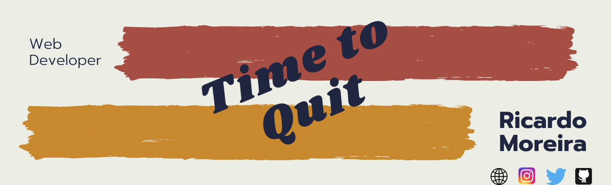
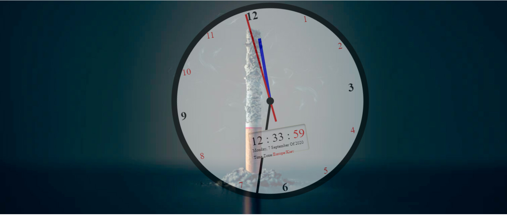

<h1 align="center"> 🔥Time to Quit</h1>

<h2 align="center"> A digital and analogic clock</h2>

### Index

* [Name](#Name) 👈
* [Links](#Links) 🔗
* [Description](#Description) 📖
* [Languages and Frameworks](####Languages-and-Frameworks) ⚙️
* [Screenshots](#Screenshots) 📱
* [Instalation](#Instalation) 🧩
* [Support](#Support) 🆘
* [Roadmap](#Roadmap) 🗺️
* [Authors and acknowledgment](####Authors-and-acknowledgment) ✍️
* [Project Status](#Project-Status) 📜

# Name

Time to quit

# Links

[Website](https://its-time-to-quit.netlify.app/)

___

# Description

A clock made with <strong>JS</strong> and <strong>CSS</strong>.
For the digital clock I worked with <em>momentjs</em>.

In JS I worked and learn with:

<ul>
<li>Functions</li>
<li>Scopes</li>
<li>Methods</li>
<li>Libraries</li>
<li>Time variables</li>
</ul>

In CSS I worked and learn with:

<ul>
<li>Animations</li>
<li>Variables</li>
<li>Positions</li>
<li>Libraries</li>
</ul>

___

# Languages, Frameworks and others

* **Javascript** - Language
* **CSS** - Styling
* **Momentjs** - Library

____

# Screenshots

Home Page         |  Blog Page
:-------------------------:|:-------------------------:
  |  

____

# Instalation

___

# Support

Have any question or find something that doesn't look good? Let's talk 😊

[Here](https://github.com/mugas)

[And Here](https://www.ricardomoreira.io/about)

____

# Roadmap

Nothing to add

____

# Authors-and-acknowledgment

* [Based on this](https://javascript30.com/)

* Me 😊

____

# Project-Status  

Nothing to add

____
